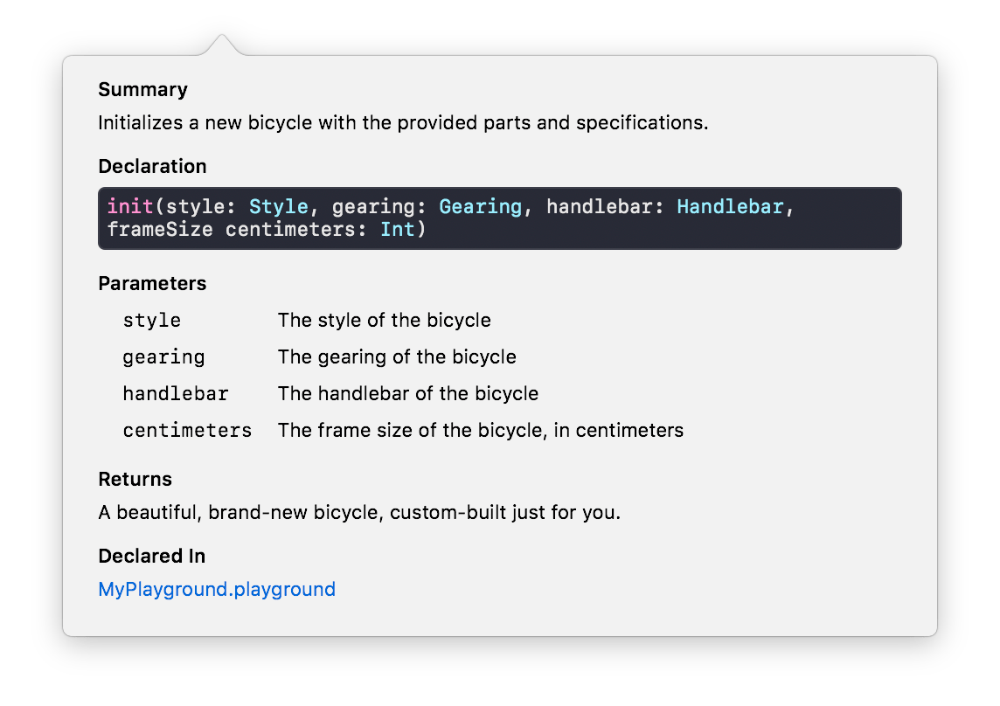

# Swift documentation

Swift code documentation as a few rules to follow that are similar to markdown that will make it easier to quickly identify the purpose of functions and objects.

Use Option+click on a symbol to make see the magic!

* [Basic markdown](#basic-markdown)
* [Keywords](#keywords)
* [More keywords](#more-keywords)
* [Examples](#examples)
* [Writing documentation](#writing-documentation)
* [Sources](#sources)


## Basic markdown
* `///` Single-line documentation comments 
* `/** ... */` Multi-line documentation comments

Standard markdown rules apply inside documentation comments:
* Paragraphs are separated by blank lines
* Unordered lists are marked by bullet characters (-, +, \*)
* Ordered lists use numerals (1,2,3, ...) followed by either a period, `1.` or right parenthesis, `1)`.
* Code snippets can be created with 3 \`'s or `~~~` before and after the snippet content.
	* Single-line snippets can also be created with \`\` like usual markdown.

## Keywords

There are several special words that Xcode recognizes that will separate them from a symbol's description so that the content is more visible and organized.

* **Parameters**: Start the line with `Parameter <param name>:` and the description of the parameter.
	* If you have many parameters you can bullet them beneath a `Parameters` keyword (Shown in example below).
* **Return values**: Start the line with `Returns:` and information about return value.
* **Thrown errors**: Start the line with `Throws:` and description of errors that can be thrown. (Very important to include on throwing functions.)


```
/**

* Parameters:
	* bees: Array of Bee objects. They may be passive or aggressive.
	* countingSpeed: The speed at which we want to count the bees.

* Throws: `HaloError.tooManyBees` if `bees` array contains more than 100 bees.

* Returns: The number of aggressive bees passed in.

*/
func countAggressiveBees(bees: [Bee], countingSpeed: Int) throws {
	// Blah
}
```

### More keywords
* Algorithm/Safety Information
	* Precondition
	* Postcondition
	* Requires
	* Invariant
	* Complexity
	* Important
	* Warning
* Metadata
	* Author
	* Authors
	* Copyright
	* Date
	* SeeAlso
	* Since
	* Version
* General Notes & Exhortations
	* Attention
	* Bug
	* Experiment
	* Note
	* Remark
	* ToDo


## Writing documentation
These are coming straight from Apple's API design guidelines.

* **Begin with a summary** that describes the entity being declared.
* **Focus on the summary** So nice we mention it twice. "Most important part" should be able to exist with only this.
* **Use a single sentence fragment** if possible, ending with a period. Do not use a complete sentence.
* **Describe what the function does and what it returns**, omitting null effects and Void returns
```
/// Inserts `newHead` at the beginning of `self`.
mutating func prepend(_ newHead: Int)

/// Returns a `List` containing `head` followed by the elements
/// of `self`.
func prepending(_ head: Element) -> List

/// Removes and returns the first element of `self` if non-empty;
/// returns `nil` otherwise.
mutating func popFirst() -> Element?
```
* **Describe what a subscript _accesses_**:
```
/// Accesses the `index`th element.
subscript(index: Int) -> Element { get set }
```
* **Describe what an initializer _creates_**:
```
/// Creates an instance containing `n` repetitions of `x`.
init(count n: Int, repeatedElement x: Element)
```
* For everything else, **describe what the entity _is_**:
```
/// A collection that supports equally efficient insertion/removal
/// at any position.
struct List {

  /// The element at the beginning of `self`, or `nil` if self is
  /// empty.
  var first: Element?
  ...
```

### Optional
* With one or more paragraph, bullet each item (as shown in [examples](#examples)).
* Paragraphs are separated by blank lines and use complete sentences.
* The preferred method of bullets seems to be the `-`.


## Examples

Apple example:

NSHipster larger class example:
```
/// 🚲 A two-wheeled, human-powered mode of transportation.
class Bicycle {
    /// Frame and construction style.
    enum Style {
        /// A style for streets or trails.
        case road

        /// A style for long journeys.
        case touring

        /// A style for casual trips around town.
        case cruiser

        /// A style for general-purpose transportation.
        case hybrid
    }

    /// Mechanism for converting pedal power into motion.
    enum Gearing {
        /// A single, fixed gear.
        case fixed

        /// A variable-speed, disengageable gear.
        case freewheel(speeds: Int)
    }

    /// Hardware used for steering.
    enum Handlebar {
        /// A casual handlebar.
        case riser

        /// An upright handlebar.
        case café

        /// A classic handlebar.
        case drop

        /// A powerful handlebar.
        case bullhorn
    }

    /// The style of the bicycle.
    let style: Style

    /// The gearing of the bicycle.
    let gearing: Gearing

    /// The handlebar of the bicycle.
    let handlebar: Handlebar

    /// The size of the frame, in centimeters.
    let frameSize: Int

    /// The number of trips traveled by the bicycle.
    private(set) var numberOfTrips: Int

    /// The total distance traveled by the bicycle, in meters.
    private(set) var distanceTraveled: Double

    /**
     Initializes a new bicycle with the provided parts and specifications.

     - Parameters:
        - style: The style of the bicycle
        - gearing: The gearing of the bicycle
        - handlebar: The handlebar of the bicycle
        - frameSize: The frame size of the bicycle, in centimeters

     - Returns: A beautiful, brand-new bicycle,
                custom-built just for you.
     */
    init(style: Style,
         gearing: Gearing,
         handlebar: Handlebar,
         frameSize centimeters: Int)
    {
        self.style = style
        self.gearing = gearing
        self.handlebar = handlebar
        self.frameSize = centimeters

        self.numberOfTrips = 0
        self.distanceTraveled = 0
    }

    /**
     Take a bike out for a spin.

     Calling this method increments the `numberOfTrips`
     and increases `distanceTraveled` by the value of `meters`.

     - Parameter meters: The distance to travel in meters.
     - Precondition: `meters` must be greater than 0.
     */
    func travel(distance meters: Double) {
        precondition(meters > 0)
        distanceTraveled += meters
        numberOfTrips += 1
    }
}
```



## Sources
* [NSHipster - Swift documentation](https://nshipster.com/swift-documentation/)
* [Apple documentation - API design guidelines](https://swift.org/documentation/api-design-guidelines/)
* [Apple documentation - markdown language](https://developer.apple.com/library/archive/documentation/Xcode/Reference/xcode_markup_formatting_ref/)